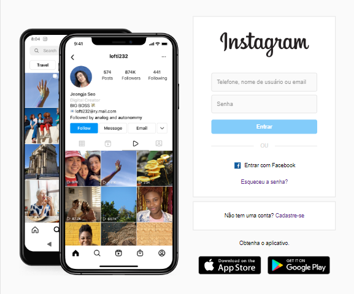

# Tela de Login Instagram

# Sobre

Clone responsivo da tela de login do Instagram, feito com CSS e Html puros. Para ser entregue como projeto da DIO.

Decidi clonar a página de login que aparece quando você não tem nenhum usuário já reconhecido.

# Coisas interessantes que aconteceram

Já que se trata de um projeto mais fins educativos, acho interessante compartilhar algumas descobertas:

1. Uso de medidas relativas para responsividade: rem, em e % por exemplo. Diria que em geral, é melhor usar qualquer unidade estatica, como o px, o mínimo possível.

2. O problema da altura de 100vh gerando barra de rolagem em alguns celulares. Resolvi usando html, body height 100%. Pelo que vi o problema tem algo a ver com como cada browser trata a barra de url, assim 100vh não é consistente.

3. Uso do @keyframes + background-image para criar a transição de imagem dos phones.

4. O uso do device toolbar pra simular algumas telas mobile, que apesar de tudo, não reflete tão bem a realidade. Foi só testando em alguns celulares que tenho que vi a tela gerando a barra de rolagem.
